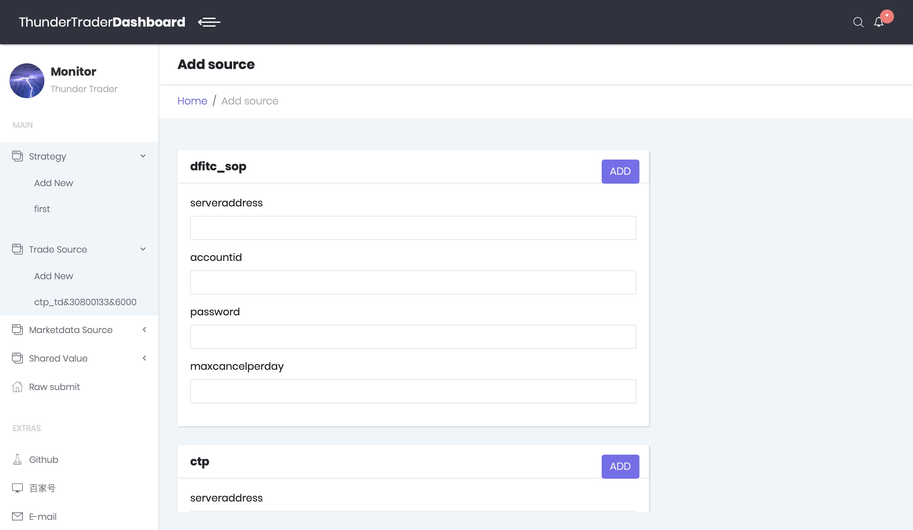
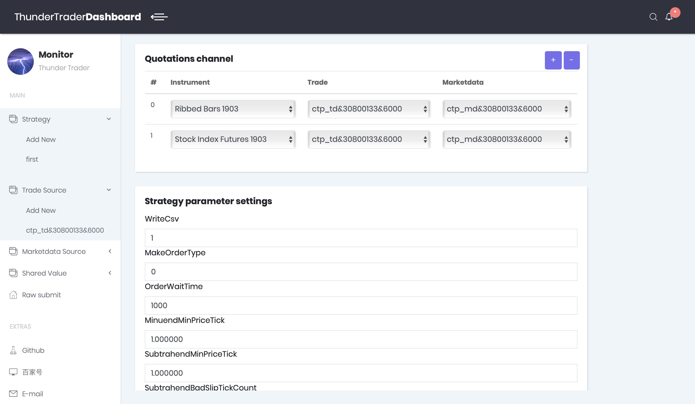

# Thunder Trader

[](http://www.huyifeng.net/HFT-start.html)
[](http://www.huyifeng.net/HFT-start.html)
[](LICENSE)

## Features

<br>
Based on C++ 11, this project implements a quantitative trading system supporting high-frequency transactions. The system supports the following characteristics:
- **Flexibility**

    - Using plug-ins to support different quotations and trading interfaces, such as CTP, Femas, Dfitc and TWS in China.
    - Support multiple accounts and multiple strategies. Each strategy can use multiple quotes, and can place orders for multiple accounts.

- **Easy to use**

    - Support both linux and windows
    - B/S architecture
    - Client with graphical interface
    - The real-time tracing of the variables in the strategy can be supported by "probe", and the display mode of the "probe" can be customized.
    - Supporting the "intervention" of the strategy, by predefining some intervention actions, to achieve a fixed operation in the transaction process.

- **Efficiency**

    - C++ implementation
    - Asynchronous event driven

## Snapshot





## User's guide
Welcome to my [personal blog](http://www.huyifeng.net/). There are User's guide.
> * [Launch thunder-trader](http://www.huyifeng.net/HFT-usage.html#start_thunder_trader)
> * [Use WebMonitor](http://www.huyifeng.net/HFT-usage.html#use_monitor)
>   * [TradeServer](http://www.huyifeng.net/HFT-usage.html#TradeServer)
>   * [UIStyle](http://www.huyifeng.net/HFT-usage.html#UIStyle)
>   * [SymbolDefine](http://www.huyifeng.net/HFT-usage.html#SymbolDefine)


## Documentation 

Welcome to my [personal blog](http://www.huyifeng.net/). There are detailed introductory manuals.

> * [Introductory](http://www.huyifeng.net/HFT-start.html)
> * [Prepare](http://www.huyifeng.net/HFT-prepare.html)
> * Strategy
> 	*  [Strategy template](http://www.huyifeng.net/HFT-strategy.html)
> 	*  [An arbitrage strategy implementation](https://github.com/solopointer/thunder-trader/tree/master/strategies/arbitrage_future)
> * Trade server 
> * Monitor
> * Research platform

## Quit start
This preject is tested in following environment:
> * gcc 7.2 or 4.8.4
> * boost 1.58.0
> * centos7

Build:
```
>cmake .
>make
>make install
>export LD_LIBRARY_PATH=/path/to/gcc/lib/:/path/to/boost/lib:$LD_LIBRARY_PATH ; /path/to/thunder-trader /path/to/thunder-trader.conf 1

Then will see output like: 
Run.SystemNumber=1 [20181021T062516.546639]
```
If you use a customed gcc path, you should specify the /path/to/gcc/lib/, such as /opt/gcc7/lib64.

As the same, if you use a customed boost path, you should specify the /path/to/boost/lib, such as /opt/boost/lib.

The usage of thunder-trader is `./thunder-trader config_file.conf system_number`, .e.g. `./thunder-trader thunder-trader.conf 1`, the system_number is a customed int that indicate the process by onlyself. You should make sure that different thunder-trader process has different system_number. 

The reason of use a system_number will be illustrated in the document.

Then you can use the WebMonitor to connect to the thunder-trader.

And if the cmake cannot find the boost, you should set the BOOST_ROOT to the custom boost install path.In the CMakeLists.txt,it should be like this: 

```
set(BOOST_ROOT /usr/local/install/boost/install/path)
```

For WebMonitor, we should firstly prepare a nginx for it.

But usually we use [openresty](http://openresty.org/cn/) because it has integrated the nginx-lua and lua-socket we need.

Our thunder-trader listens the local port. WebMonitor communicates with thunder-trader through lua-socket.

The following is the process of building WebMonitor.
> * Downloads [openresty-1.13.6.2.tar.gz](https://openresty.org/download/openresty-1.13.6.2.tar.gz) from [Openresty.org](http://openresty.org/cn/download.html)
> * tar zxvf openresty-1.13.6.2.tar.gz 
> * cd openresty-1.13.6.2
> * ./configure --prefix=/path/to/openresty/install --with-luajit  
> * make -j8
> * make install

Then set the nginx conf /path/to/openresty/install/nginx/conf/nginx.conf file like [nginx.example.conf](./nginx.example.conf).

The main point is:

* thunder-trader interface 

Our browser uses jQuery to communicate with this interface.

```
location /thunder-trader {
    default_type application/json;
    content_by_lua '
        local bit = require("bit")
        local thunder_trader_ip = "127.0.0.1"
        local thunder_trader_port = 8800
        if "POST" ~= ngx.var.request_method then
            ngx.exit(ngx.HTTP_BAD_REQUEST)
        end
        
        ngx.req.read_body()
        local body = ngx.req.get_body_data()
        if body == nil then
            local file_name = ngx.req.get_body_file()
            if file_name then
                body= getFile(file_name)
            else
                ngx.exit(ngx.HTTP_INTERNAL_SERVER_ERROR)
            end
        end
        
        local sock = ngx.socket.tcp()
        local ok,err = sock:connect(thunder_trader_ip, thunder_trader_port)
        if not ok then
            ngx.log(ngx.ERR, err)
            ngx.exit(ngx.HTTP_BAD_REQUEST)
        end
        sock:settimeout(5000)
        len = string.len(body) + 4
        h0 = bit.band(len, 0xff)
        h1 = bit.rshift(bit.band(len, 0xff00), 8)
        h2 = bit.rshift(bit.band(len, 0xff0000), 16)
        h3 = bit.rshift(bit.band(len, 0xff000000), 24)
        buffer_tobe_send = string.char(h0,h1,h2,h3)..body
        
        local ok, err = sock:send(buffer_tobe_send)
        if not ok then
            ngx.log(ngx.ERR, err)
            ngx.exit(ngx.HTTP_BAD_REQUEST)
        end
        
        local response_head, err, partial = sock:receive(4)
        if not response_head then
            ngx.log(ngx.ERR, err)
            ngx.exit(ngx.HTTP_INTERNAL_SERVER_ERROR)
        end
        
        h0 = string.byte(string.sub(response_head, 1,1))
        h1 = string.byte(string.sub(response_head, 2,2))
        h2 = string.byte(string.sub(response_head, 3,3))
        h3 = string.byte(string.sub(response_head, 4,4))
        
        ret_len = h0 + bit.lshift(h1, 8) + bit.lshift(h2, 16) + bit.lshift(h3, 24)
        if ret_len < 0 then
            ngx.log(ngx.ERR, "Response len > MAX_LEN")
            ngx.exit(ngx.HTTP_BAD_REQUEST)
        end
        local response_body, err, partial = sock:receive(ret_len - 4)
        if not err then
            ngx.say(response_body)
        else
            ngx.log(ngx.ERR, err)
            ngx.exit(ngx.HTTP_BAD_REQUEST)
        end
        sock:close()
    ';
}
```

Note that the variable **thunder_trader_ip**, **thunder_trader_port** indicates the ip:port of thunder-trader, which is configured in thunder-trader.conf.default by default of 0.0.0.0:8800.

* Specify a path for WebMonitor's web application.
```
location / {
    root   /path/to/monitor;
    index  index.html index.htm;
}
```
The WebMonitor is a pure html/js web application, all HTML and JS files are in /path/to/monitor.

* Set the listening port or nginx.

```
listen       8080;
```

Please distinguish thunder-trader's listening port 8800 from nginx's listening port 8080.

Once you've done the above, you can access WebMonitor at http://127.0.0.1:8080/.


## Update log
* 2018.11.20 : Support gcc 4.8.4
* 2018.12.04 : Update arbitrage_strategy & simple_strategy
* 2018.12.20 : Commit the Monitor v0.1
* 2019.03.19 : WebMonitor v0.1 (Without graph, developping)


## Ask Questions

E-mail:solopointer@qq.com or QQ Group:628409183

<br><br>

Particular attention:
If you encounter an 
```
^C*** Error in `./thunder-trader': double free or corruption (!prev): 0x0000000001e32bb0 ***
```
like error when run thunder-trader, don't worry. This is a bug in CTPLibrary that usually appears when the process exit, 
but does not affect the normal operation of the program.Turn off the ctp option, or tell me how to avoid this error if you knows please.

If you like this project, give me a star ^_^

## Copyright and License
Thunder-trader is provided under the [Apache-2.0 license](LICENSE).
